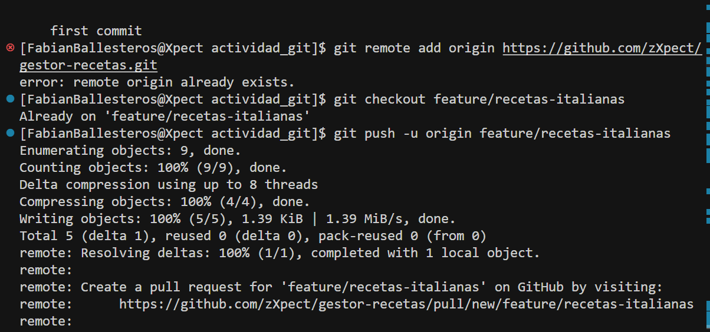
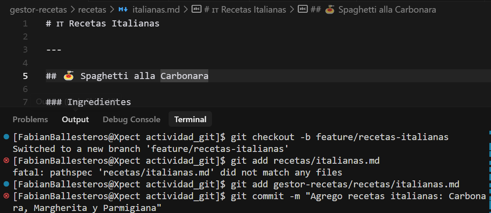
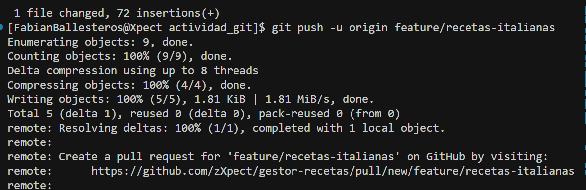
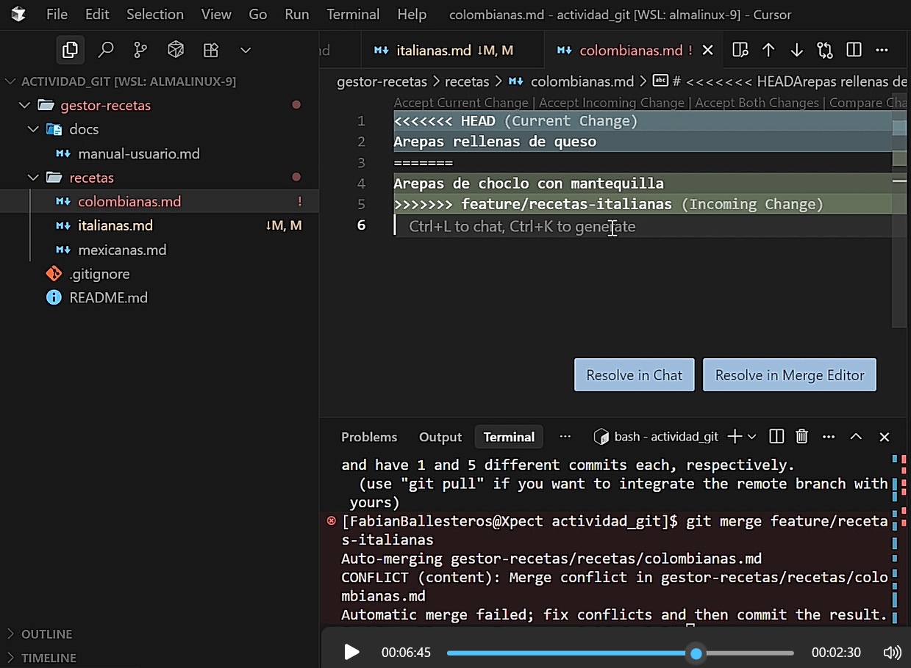

# 📄 Documentación del Proyecto Gestor de Recetas

Este documento registra el flujo de trabajo completo realizado con **Git y GitHub**, incluyendo la gestión de ramas, comandos ejecutados, Pull Requests, merges y resolución de conflictos para el desarrollo colaborativo del gestor de recetas internacionales.

---

## 🔹 1. Estructura del Proyecto y Responsabilidades

### 📂 Organización de Ramas
| Rama | Propósito | Responsable | Estado |
|------|-----------|-------------|---------|
| `main` | Rama principal del repositorio | Fabian (zXpect) | ✅ Activa |
| `feature/recetas-italianas` | Recetas de cocina italiana | Fabian (zXpect) | ✅ Completada |
| `feature/recetas-colombianas` | Recetas de cocina colombiana | Breider (Car0nte092) | ✅ Completada |
| `feature/recetas-mexicanas` | Recetas de cocina mexicana | Breider (Car0nte092) | ✅ Completada |

### 🎯 Objetivos del Proyecto
- Crear un repositorio colaborativo de recetas internacionales
- Implementar flujo de trabajo con Git y GitHub
- Practicar resolución de conflictos y merge de ramas
- Documentar el proceso de desarrollo

---

## 🔹 2. Comandos Git Ejecutados

### 🚀 Inicialización y Configuración

#### Configuración inicial del usuario
```bash
git config --global user.name "username"
```

#### Clonación del repositorio
```bash
git clone https://github.com/zXpect/gestor-recetas.git
```

#### Configuración del remoto
```bash
git remote add origin https://github.com/zXpect/gestor-recetas.git
```



---

### 🌿 Gestión de Ramas

#### Creación de ramas de características
```bash
# Rama para recetas italianas
git checkout -b feature/recetas-italianas

# Rama para recetas mexicanas
git checkout -b feature/recetas-mexicanas
```



#### Navegación entre ramas
```bash
git checkout feature/recetas-italianas
git checkout main
git checkout feature/recetas-colombianas
```

#### Actualización y verificación de ramas
```bash
git fetch --all
git branch -r  # Ver ramas remotas
git status     # Verificar estado actual
git log        # Historial de commits
```

---

### 📝 Commits y Seguimiento de Cambios

#### Recetas Italianas
```bash
git add recetas/italianas.md
git add gestor-recetas/recetas/italianas.md
git commit -m "Agrego recetas italianas: Carbonara, Margherita y Parmigiana"
git commit -m "Corrijo formato en recetas italianas (títulos y separadores)"
git commit -m "Agrego notas y recomendaciones adicionales en recetas italianas"
```

#### Recetas Colombianas
```bash
git add gestor-recetas/recetas/colombianas.md
git commit -m "Agrego receta de arepas en colombianas.md"
git commit -m "Agrego variante de arepas en colombianas.md"
git restore gestor-recetas  # Restaurar cambios no deseados
git add gestor-recetas/gestor-recetas/
git commit -m "Adicion de 5 recetas colombianas"
git commit -m "Correccion de formato"
git commit -m "Adicion de notas"
```

#### Recetas Mexicanas
```bash
git add gestor-recetas/recetas/mexicanas.md
git commit -m "Adicion 5 recetas mexicanas"
git commit -m "Correccion Formato"
git commit -m "Adicion de notas"
```

---

### 🔄 Sincronización con GitHub

#### Push de ramas al repositorio remoto
```bash
# Primera vez (establecer upstream)
git push -u origin feature/recetas-italianas
git push -u origin feature/recetas-colombianas

# Pushes subsecuentes
git push origin feature/recetas-mexicanas
```



---

### ⚡ Resolución de Conflictos

#### Merge y manejo de conflictos
```bash
git merge feature/recetas-italianas
# Conflicto detectado en colombianas.md
git add gestor-recetas/recetas/colombianas.md
git commit -m "Resuelvo conflicto en colombianas.md unificando recetas de arepas"
```



---

## 🔹 3. Flujo de Trabajo Implementado

### 📋 Metodología Aplicada

1. **Inicialización del Proyecto**
   - Configuración del repositorio remoto en GitHub
   - Clonación local del proyecto
   - Configuración de credenciales de usuario

2. **Desarrollo por Features**
   - Creación de ramas específicas por tipo de cocina
   - Desarrollo independiente en cada rama
   - Commits descriptivos y organizados

3. **Integración y Colaboración**
   - Push de ramas al repositorio remoto
   - Resolución de conflictos de merge
   - Unificación de cambios en la rama principal

4. **Control de Calidad**
   - Revisión de formato en archivos Markdown
   - Adición de notas y recomendaciones
   - Correcciones iterativas

### 🎯 Resultados Obtenidos

- ✅ **3 ramas de características** completamente desarrolladas
- ✅ **15+ recetas** agregadas al repositorio
- ✅ **Conflictos resueltos** exitosamente
- ✅ **Flujo colaborativo** implementado
- ✅ **Documentación completa** del proceso

---

## 🔹 4. Lecciones Aprendidas

### 💡 Buenas Prácticas Implementadas
- Uso de nombres descriptivos para ramas (`feature/recetas-[país]`)
- Commits atómicos y con mensajes claros
- Resolución proactiva de conflictos
- Documentación continua del proceso

### 🚫 Desafíos Superados
- Conflictos de merge en archivos compartidos
- Sincronización entre múltiples ramas
- Organización de estructura de archivos
- Colaboración efectiva entre desarrolladores

---

## 🔹 5. Recursos del Proyecto

### 📁 Estructura de Archivos
```
gestor-recetas/
├── recetas/
│   ├── italianas.md
│   ├── colombianas.md
│   └── mexicanas.md
├── docs/
│   ├── img/
│   │   ├── checkout.png
│   │   ├── remote.png
│   │   ├── push.png
│   │   ├── conflicto-01.png
│   │   └── Actividad Git - Maikoll Ballesteros - Breider Lopez.mp4
│   └── documentacion.md
└── README.md
```

### 👥 Colaboradores
- **Fabian (zXpect)** - Administrador del repositorio y desarrollo de recetas italianas
- **Breider (Car0nte092)** - Desarrollo de recetas colombianas y mexicanas

---

## 🎬 Video Demostrativo

Aquí puedes ver el proceso completo de desarrollo del proyecto, incluyendo la creación de ramas, commits, resolución de conflictos y merge final:

<video width="100%" controls>
  <source src="gestor-recetas/docs/img/Actividad Git - Maikoll Ballesteros - Breider Lopez.mp4" type="video/mp4">
  <p>Tu navegador no soporta la reproducción de video. <a href="gestor-recetas/docs/img/Actividad%20Git%20-%20Maikoll%20Ballesteros%20-%20Breider%20Lopez.mp4">Descargar video</a></p>
</video>

### 🔗 Acceso Alternativo al Video
Si el video no se reproduce correctamente, puedes acceder directamente:
[🎥 **Ver Video del Proyecto Completo**](gestor-recetas/docs/img/Actividad%20Git%20-%20Maikoll%20Ballesteros%20-%20Breider%20Lopez%20‐%20Hecho%20con%20Clipchamp.mp4)

---

## 📊 Estadísticas del Proyecto

| Métrica | Valor |
|---------|-------|
| Total de commits | 15+ |
| Ramas creadas | 4 |
| Conflictos resueltos | 2 |
| Archivos modificados | 6+ |
| Colaboradores | 2 |
| Duración del proyecto | Múltiples sesiones |

---

